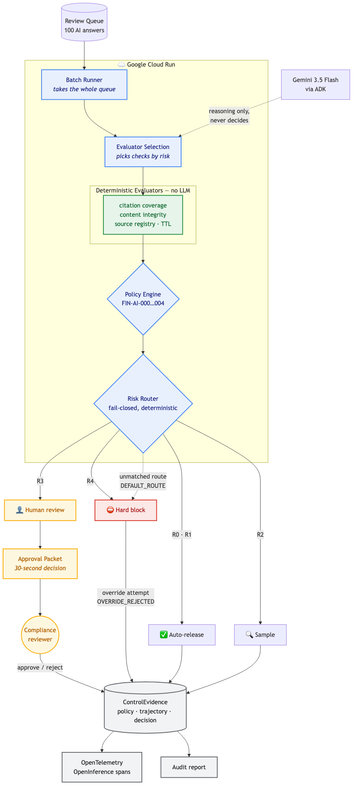

# Release Assessment Agent

Turns AI evidence into defensible release/no-release decisions for financial AI
outputs. Not governance (doesn't define policy boundaries) and not
observability (doesn't just produce signals) — this is the decision layer: it
decides what gets released, on what basis, with what evidence, and it refuses
release even when a human with approval authority says yes.

**Live:** https://assurance-agent-6eqpujphvq-de.a.run.app
**Stack:** Gemini 3.5 Flash · Google ADK 2.7.1 · Cloud Run · OpenTelemetry/OpenInference
**Category:** All Things Agentic Hackathon — The Taskmaster


```
 BATCH RUN — 100 AI-generated answers, one pass
 ─────────────────────────────────────────────────────────────────────
  AUTO-RELEASE      SAMPLE          HUMAN REVIEW      HARD BLOCK
       54              28                 9                9
   FIN-AI-010      FIN-AI-009        FIN-AI-008     FIN-AI-005 / 011
  all evaluators   low-confidence    evaluator      evaluator FAIL
  PASS, high conf   PASS, sampled     WARN           or SENSITIVE
 ─────────────────────────────────────────────────────────────────────
  18 of 100 items reached a person.       ← measured: count of routes
  Estimated review time 240 → 43.2 min.   ← ESTIMATE, see below
 ─────────────────────────────────────────────────────────────────────
  Synthetic corpus. The 82% time reduction is an ESTIMATE derived from
  a 2.4 min/item baseline that has no timed-pilot backing; it is not a
  measured 82% reduction in human effort. The measured figure is the
  routing itself: 18 items escalated, 82 released or sampled with
  committed ControlEvidence. See docs/baseline-estimate.md.
```

Counts are reproducible: `python -m assurance.batch --queue data/queue.jsonl`,
committed at [`evidence/S2-batch-run.json`](evidence/S2-batch-run.json).

---

## Architecture



The batch pipeline processes a queue of AI-generated answers awaiting
release; the agent and its hard-policy gate run on Cloud Run (see
"What runs where" below). Gemini selects which checks each item warrants;
**deterministic evaluators produce the evidence and a policy engine makes
the decision** — the model is never the decision authority. Unmatched risk
classifications fall through to a hard block, so an
unclassified item cannot pass silently. Every decision emits
`ControlEvidence` containing the governing policy, the execution
trajectory, and the component that made the call.

---

## Claim ↔ code path

| Claim | Code |
|---|---|
| Hard policy can't be overridden by human approval | `assurance/hard_policy.py::HardPolicyGate`, `tests/test_s6_override.py` |
| Fail-closed at every layer (unknown → most restrictive) | `assurance/policy.py::route_item`, `assurance/sovereignty.py::check_sovereignty`, `assurance/planner.py` fallback |
| LLM only triages which checks to run, never decides the outcome | `assurance/planner.py` (`EvaluationPlan`, `LlmAgent`, no tools) |
| Deterministic evidence per item | `assurance/evaluators.py` (4 pure evaluators) → `assurance/schema.py::ControlEvidence` |
| Every decision traceable to which component decided it | `assurance/tracing.py` (`guardrail_span`/`evaluator_span`), `assurance/trajectory.py::assert_decided_by` |
| Data sovereignty (SENSITIVE never egresses) | `assurance/sovereignty.py::SovereigntyGatePlugin` (batch layer: wired into `assurance/batch.py`; ADK plugin layer: written, **not yet registered** in `deploy_agent/agent.py` — see “What runs where” below) |
| Cross-process human approval | `assurance/approval_store.py` (SQLite), `scripts/resolve.py` |
| Machine-readable capability/policy declaration | `scripts/gen_agent_card.py` → `/.well-known/agent.json` |

## Repository layout

```
assurance/              the pipeline -- no ADK dependency except the plugins
  policy.py             risk router: evaluator results + data_class -> route  (FIN-AI-005..010)
  policy_ids.py         single source of truth for every policy id
  evaluators.py         4 pure functions, zero LLM, deterministic
  planner.py            Gemini triage: picks which evaluators to run, never decides release
  batch.py              queue runner: sovereignty -> planner -> evaluators -> route -> evidence
  hard_policy.py        HardPolicyGate -- R4 refuses human override           (FIN-AI-004)
  plugin.py             HardPolicyPlugin / EgressGatePlugin                   (FIN-AI-000..003)
  sovereignty.py        data_class egress check + ADK plugin                  (FIN-AI-011)
  approval_store.py     SQLite escalation store, survives process exit
  packet.py             approval packet: gives the reviewer A/B/C options, not a report
  metrics.py            time estimate; the ESTIMATE disclaimer is a module constant
  tracing.py            OpenInference guardrail_span / evaluator_span
  trajectory.py         5 invariant assertions incl. assert_decided_by
deploy_agent/           what actually runs on Cloud Run (App + plugin chain + serve.py)
data/                   make_queue.py (seeded generator) -> queue.jsonl (100 items, committed)
evidence/               committed JSON from every spike -- every number in this README is here
tests/                  S1..S10 spikes
docs/
  architecture.md       the diagram source (mermaid) and what each element means
  decision-log.md       what was decided during the nine spikes, and why
  baseline-estimate.md  where the 2.4 min/item estimate comes from
  archive/              development records -- planning, drafts, research notes
```

**Start here:** `assurance/policy.py::route_item` is the decision. Everything
else feeds it or records it.

## What I learned

**A correct outcome reached by the wrong path is still a bug.** R4 was
blocking correctly, every test passed, and the demo looked done — until I
read the actual execution trajectory and found the block came from
`HardPolicyPlugin` misclassifying the request as an unregistered source
(`assess_release` has no `url` parameter, so the source lookup returned
`UNKNOWN` and failed closed), not from `HardPolicyGate`'s R4 check at all. The framework short-circuits on the
first plugin that returns non-`None`, so a wrong reason produces the same
visible result as a right one. This is why the pipeline treats trajectory
as part of the evaluation contract (`assert_decided_by`), not just the
final `result` field.

**Framework defaults sit on the unsafe side of the line.** Three
independent cases, each verified against the ADK 2.7.1 wheel source, not
docs: Agent-layer tool callbacks short-circuit on a *truthy* return (`{}`
silently passes), Graph Workflow routing logs a warning and silently ends
a branch on an unmatched route with no `DEFAULT_ROUTE`, and the Plugin
chain stops at the first non-`None` return. None of these are bugs — they
are reasonable defaults for general use. But each resolves toward "quietly
continue," so an explicit fail-closed fallback and plugin-layer
enforcement (not agent-layer) aren't nice-to-haves — they're the only way
an unclassified state fails closed instead of silently passing. I did not
end up using Graph Workflow: `route_item()` is a plain `if`/`elif` chain
whose first branch rejects any unrecognized `data_class`. Same guarantee,
expressed in code I can test without the framework.

**A generator/threshold mismatch is the same bug twice if you only fix it
halfway.** The corpus generator drew random source ages up to 110 days
while the evaluator enforces a 90-day FAIL threshold — producing 15 blocks
that weren't part of the designed R2/R3/R4 sample. The first fix
(`max_age_days=75`) cleared the FAIL line but missed that `source_ttl` has
a second, lower WARN threshold at `90 × 0.7 = 63` days, so the same class
of noise resurfaced one tier down. Both fixes align the generator to a
threshold that already exists in the evaluator; neither invents a
threshold to hit a target ratio — the corpus's own docstring states counts
are not tuned, and the final distribution (`AUTO 54 · SAMPLE 28 ·
HUMAN_REVIEW 9 · BLOCK 9`) is what fell out once the mismatch was gone.

## Why Taskmaster, not Fortified Enterprise Fleet

The Fleet track evaluates multi-agent delegation: specialized agents, a
registry, inter-agent routing with failure recovery. **This system is
deliberately not that.** Its central claim is that release decisions
belong to a deterministic policy engine, not to a model — so adding agents
that delegate to each other would weaken the thing it exists to
demonstrate.

What it *is*: an autonomous multi-step workflow that takes a queue of 100
AI-generated answers, decides per item which checks are warranted, gathers
deterministic evidence, routes by risk, and escalates only what needs a
person. **18 of 100 items reached a human.** That is friction removed by
execution, which is what Taskmaster asks for.

Two capabilities built for the Fleet track are kept because they earn
their place here:

| Capability | Status |
|---|---|
| Agent card (`/.well-known/agent.json`) | **Live.** Generated from `policy_ids.py`, served by the deployed service. Discovery metadata — *not* an enterprise Agent Registry. |
| Cross-process human approval | **Live.** SQLite-backed (`data/approvals.db`), verified across two independent process invocations. In-flight batch state is not persisted; only decisions are. |
| Data sovereignty | **Batch layer only.** `check_sovereignty()` blocks SENSITIVE items with evidence in `assurance/batch.py`. The ADK `SovereigntyGatePlugin` exists but is **not registered** in the deployed plugin chain. |

## What runs where

Accuracy matters more here than a bigger claim:

| Component | Where it runs |
|---|---|
| `release_assessment` agent + `HardPolicyGate` (R4 override rejection) | **Deployed** on Cloud Run — `evidence/S8-e2e-r4-block.json` |
| `/.well-known/agent.json` | **Deployed** on Cloud Run |
| `assurance.batch` 100-item pipeline | **Local** — `python -m assurance.batch`, committed output in `evidence/S2-batch-run.json` |
| `SovereigntyGatePlugin` | **Written, not deployed** |

The batch pipeline does not call the deployed agent per item by design:
the plugin-layer guarantee is already proven end-to-end by S1/S6/S8, and
running 100 items through it would add LLM cost without adding evidence.

## Run locally

```bash
# Python 3.14
uv venv --python 3.14 && source .venv/bin/activate
uv pip install -r requirements.txt

# Gemini API key (planner only -- the pipeline runs fail-closed without it)
cp .env.example .env && $EDITOR .env

python -m assurance.batch --queue data/queue.jsonl   # end-to-end batch run, 100 items
python tests/test_s10_planner.py                     # planner consistency + fail-closed
adk web spike_agent                                   # interactive dev UI
```

**No API key?** The batch still runs end-to-end: the planner fails closed and
every item is evaluated against all four evaluators. That path is the one
verified in `evidence/S10-results.json`.

## Deploy

```bash
gcloud run deploy assurance-agent --source . --region=asia-east1 --min-instances=1
```

`adk deploy cloud_run` does not bundle sibling packages, so `assurance/`
never reaches the container that way — `gcloud run deploy --source .` with
the `Dockerfile` in this repo is the path that works. The REST API's
`app_name` is the folder name (`deploy_agent`), not the value passed to
`App(name=...)`.
