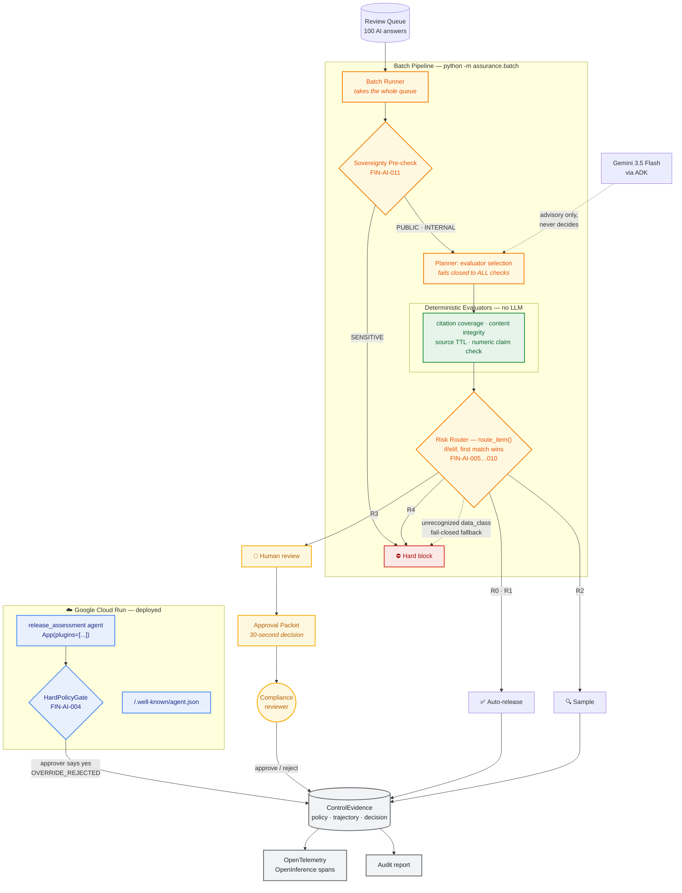
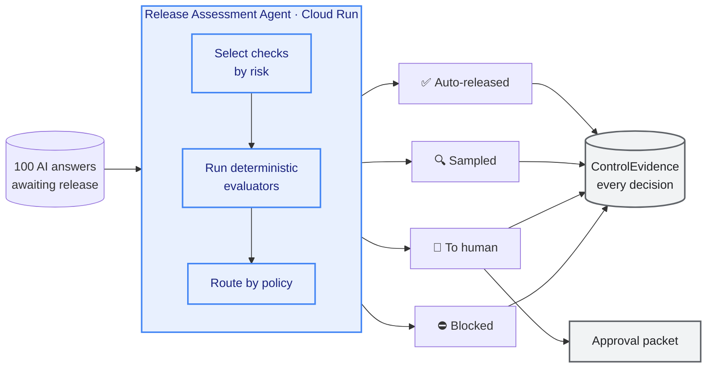

# 架構圖 — Release Assessment Agent

**用途：** Devpost 提交（硬性要求）+ README
**設計原則（依評審 Q&A）：** consumable、一眼看出元件與連接、**切忌塞滿像論文一樣的文字**
**賽道：** Taskmaster — 強調流程與動作，不強調治理層級

---

## 主圖（貼進 README，GitHub 原生渲染）



---

## 圖裡刻意編碼的四件事

**① Gemini 用虛線，標註 "never decides"**
評審會看你在哪裡用 LLM。虛線 + `reasoning only` 明確表示：**模型選工具，政策引擎做決定**。這一眼就把你和「LLM 決定一切」的作品區分開。

**② 無法識別的 data_class 用虛線指向 Hard block（fail-closed fallback）**
這是 fail-closed 拓撲。**未匹配的風險等級不會靜默通過。** `route_item()` 的第一個分支就
拒絕任何無法識別的 `data_class`（`assurance/policy.py`）——不是最後的 fallback，是最先檢查的
條件。100 筆批次的每一筆都帶著路由它的 `policy_id`，見 `evidence/S2-batch-run.json`。

**③ 人類在圖的下半部，且有回饋箭頭**
Taskmaster 賽道要看 "sends the right info to the right places"——**核准包 → reviewer → 回寫 evidence** 這條線就是它。

**④ 四條路由用顏色分**
綠（放行）、黃（人工）、紅（封鎖）。與影片 Remotion 的決策態配色一致，判讀成本降到最低。

---

## 匯出 PNG 給 Devpost

Devpost 需要圖檔，GitHub 只吃 Mermaid 原始碼。三個方法，由快到慢：

**方法 1（最快）** — [mermaid.live](https://mermaid.live) 貼上 → 右側 `Actions` → `PNG`
**方法 2** — README 推上 GitHub 後直接截圖渲染結果（解析度較低）
**方法 3（品質最好）**
```bash
npx -y @mermaid-js/mermaid-cli -i architecture.mmd -o architecture.png -w 1600 -b transparent
```

> ⚠️ 匯出後**自己看一遍**：確認 subgraph 標籤沒有被截斷、四條路由的顏色都出得來。Mermaid 在不同渲染器的 `classDef` 支援度略有差異。

---

## 若嫌太複雜的簡化版（備案）

評審說「一眼看懂」。若上圖在 4 分鐘影片裡出現時顯得太密，用這個：



**不寫死數字。** 圖形是結構說明，數字會隨語料重跑而變，寫死圖裡就要在每次重跑後改圖。

旁白或投影片文字只引用**不變量**：`HUMAN_REVIEW 9 / BLOCK 9 / RELEASED 82`——三者跨三次獨立跑（含一次 planner 完全停擺）以 assessment id 比對皆相同。`AUTO / SAMPLE` 的分裂**不是**不變量（觀測 `54/28`、`43/39`、`59/23`），因為它取決於 planner 選了哪些 evaluator；它是抽樣決策，不是放行決策。見 `evidence/S2-planner-variance.json`。

---

## 放哪裡

| 位置 | 用哪版 |
|---|---|
| README（架構章節）| 主圖 Mermaid，GitHub 原生渲染 |
| Devpost 提交欄位 | 主圖匯出的 PNG |
| 影片 0:00–0:35 | 簡化版，Remotion 重繪（**這是「幫助理解」不是「證明」，可以用動畫**）|

---

## 給 README 的一段配文（架構圖下方）

> The batch pipeline processes a queue of AI-generated answers awaiting release; the agent and its
> hard-policy gate run on Cloud Run.
> Gemini selects which checks each item warrants; **deterministic evaluators produce the evidence and
> a policy engine makes the decision** — the model is never the decision authority.
> An unrecognized `data_class` falls through to a hard block, so an unclassified item
> cannot pass silently. Every decision emits ControlEvidence containing the governing policy, the
> execution trajectory, and the component that made the call.

**約 75 字，一段。** 評審說架構圖旁不要長篇大論——**這段放 README 圖的下方，不要放進圖裡。**
